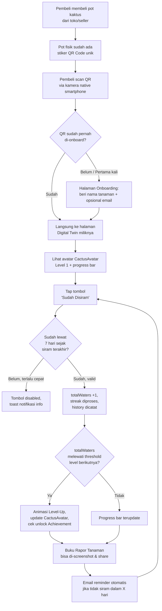

# Product Requirements Document (PRD)
# PLANTAGOCHI — Phygital Gamification SaaS Platform

| | |
|---|---|
| **Versi Dokumen** | 1.1 (Draft) |
| **Status** | Untuk Review Tim |
| **Disusun Berdasarkan** | Business Plan, Laporan Studi Kelayakan Bisnis, Tugas UTS Technopreneurship, Repository Codebase (`PLANTAGOCHI/app`) |
| **Repo Reference** | `https://github.com/yurnszzz/PLANTAGOCHI` (local path: `C:\Plantagochi\PLANTAGOCHI`) |
| **Disusun oleh** | Claude (acting as Senior PM / Tech Lead reviewer) |
| **Target Pembaca** | Tim Engineering (Frontend/Backend), Tim Produk, Co-founder |
| **Riwayat Revisi** | **v1.0** — Draft awal berdasarkan PDF + codebase. **v1.1** — Keputusan stack backend difinalisasi ke **Firebase** (Firestore + Authentication + Cloud Functions + Cloud Scheduler), menggantikan rekomendasi awal PostgreSQL/Supabase di §1.4 dan §2.5. Lihat §0 poin 6 untuk alasan keputusan. |

---

## 0. Catatan Tinjauan Kritis (Wajib Dibaca Sebelum Eksekusi)

Sebelum masuk ke spesifikasi, ada beberapa **inkonsistensi material** antara dokumen bisnis (PDF) dan kondisi aktual *codebase* yang harus diselesaikan dulu oleh tim — karena PRD ini akan mengikuti **kondisi riil di codebase** sebagai *source of truth* teknis, bukan asumsi di dokumen lama. Ini bukan nitpicking; kalau dibiarkan, tim engineering bisa membangun fitur berdasarkan asumsi yang sudah usang.

| # | Temuan | Detail | Rekomendasi |
|---|--------|--------|--------------|
| 1 | **Business model pivot belum dikonsolidasikan** | Ketiga dokumen PDF (Business Plan, Laporan Studi Kelayakan, UTS) mendeskripsikan model **B2C murni**: 5 mahasiswa menjual pot kaktus langsung ke konsumen via bazaar/Instagram/TikTok. Tapi `README.md` dan seluruh UI (`HeroSection.jsx`, `PricingPage.jsx`, `FeaturesSection.jsx`) di codebase sudah mendeklarasikan diri sebagai **platform SaaS B2B white-label** ("Platform SaaS untuk Penjual Kaktus") dengan tiering Starter/Business/Enterprise. Ini dua model bisnis yang berbeda secara fundamental (*direct-to-consumer retail* vs *multi-tenant SaaS*). | PRD ini mengikuti arah **SaaS B2B** karena itu yang sudah tertanam di kode dan menjadi konteks brief Anda. Tapi proyeksi finansial di PDF (modal awal, BEP, target unit) **tidak otomatis valid** untuk model SaaS — perlu di-*redo* dengan asumsi MRR/ARR, churn, CAC per seller, bukan margin per pot. |
| 2 | **Inkonsistensi internal antar-PDF** | Business Plan menyebut modal awal **Rp 1.500.000**, BEP di **80 unit**, reveni tahun-1 **Rp 60–80 jt** (namun tabel P&L-nya sendiri menghasilkan **Rp 120.750.000**). Laporan Studi Kelayakan menyebut modal awal **Rp 715.000**, BEP di **58 unit**, revenue 6 bulan **Rp 27.510.000**. Ini dua skenario finansial yang tidak match satu sama lain. | Jangan jadikan satupun angka ini sebagai *hard target* di OKR sebelum tim finance (CFO — M. Ibrahim) merilis **satu** model finansial final yang direkonsiliasi. |
| 3 | **Kontradiksi pricing di dalam codebase itu sendiri** | `CTASection.jsx` masih menulis copy lama: *"Mulai dari Rp 25.000 per pot, **tanpa biaya langganan**"* — ini bertentangan langsung dengan `PricingPage.jsx` yang menjual paket **Business Rp 149.000/bulan** (subscription). Ini sisa (*residual*) dari proses pivot B2C → SaaS yang belum dibersihkan. | **Quick win bug fix**: update copy di `CTASection.jsx` agar konsisten dengan model subscription SaaS sebelum demo/launch ke calon investor atau dosen. |
| 4 | **Tech stack yang Anda sebutkan tidak 100% cocok dengan `package.json`** | Anda menyebut "Zustand" sebagai bagian stack — **tidak ditemukan** di `package.json` maupun di kode manapun. State management saat ini murni `useState` + `localStorage` di level komponen (`DemoPage.jsx`). Juga, versi build tool di `package.json` adalah **Vite `^8.0.12`** dan **React Router `^7.17.0`**, bukan "Vite 6" seperti disebutkan. `lucide-react` versinya `^1.18.0`. | Saya akan mendokumentasikan **stack aktual**, dan menandai Zustand sebagai *rekomendasi untuk Phase 2* (lihat §1.4), bukan sebagai stack yang sudah terpasang. |
| 5 | **Gap besar antara "marketing copy" dan "implementasi nyata"** | Landing page (`FeaturesSection.jsx`, `PricingPage.jsx`, FAQ) **menjanjikan**: integrasi EmailJS otomatis, generate QR Code per tanaman dari dashboard, analytics dashboard, export data pelanggan, custom domain, achievement system penuh. Setelah inspeksi `app/src/`, **tidak ada satupun backend, dashboard seller, sistem auth, generator QR, atau integrasi email yang benar-benar terimplementasi.** Yang ada hanya: landing page statis, 1 halaman demo simulasi (`DemoPage.jsx`) yang state-nya hidup di `localStorage` browser, dan halaman pricing statis. | Ini adalah temuan paling penting di PRD ini. §1.3 dan §2.7 akan memberi status **per-fitur** (Built / Partially Built / Not Built) supaya tim tidak salah asumsi soal "berapa banyak yang sudah jadi". |
| 6 | **Keputusan stack backend: Firebase (final, per diskusi tim — v1.1)** | Rekomendasi awal di draf v1.0 adalah PostgreSQL via Supabase. Setelah dievaluasi ulang, **Firebase** (Firestore + Authentication + Cloud Functions + Cloud Scheduler) dipilih sebagai arah final, dengan alasan utama: (a) Cloud Scheduler menyelesaikan masalah arsitektural reminder email yang tidak bisa dipenuhi EmailJS (lihat §2.3.4); (b) project gratis Supabase di-*pause* otomatis setelah 7 hari tanpa aktivitas — ironisnya ini justru menyerang *use case* inti Plantagochi (menjangkau pengguna yang sedang tidak aktif), sementara Firebase tidak punya masalah ini. | Konsekuensi yang harus disadari tim: Firebase **mewajibkan** paket Blaze (pay-as-you-go) untuk memakai Cloud Functions — artinya **wajib ada kartu kredit/debit terpasang** sejak hari pertama, dan **wajib** pasang Budget Alert di Google Cloud Console untuk mencegah *bill shock* (Firebase tidak punya hard spending cap). Detail lengkap di §1.4, §2.5, dan §2.6.4. |

---

## BAGIAN 1 — PRODUCT OVERVIEW

### 1.1 Apa Itu Plantagochi

Plantagochi adalah **platform phygital (physical + digital) berbasis SaaS** yang menjual *engagement layer* gamifikasi kepada **penjual tanaman kaktus/sukulen mini** (B2B), yang kemudian penjual tersebut menghadirkannya sebagai pengalaman tambahan kepada **konsumen akhir** mereka (B2C, namun pelanggannya si penjual — bukan pelanggan Plantagochi secara langsung).

Posisi produk dapat dipecah menjadi dua sisi:

1. **Sisi Penjual (B2B SaaS, white-label)** — Penjual kaktus mendaftar ke platform Plantagochi, memilih tier (Starter/Business/Enterprise), lalu menggunakan dashboard untuk *generate* QR Code unik per pot yang akan ditempel sebelum dijual ke pembeli mereka. Penjual membayar biaya subscription bulanan (model **recurring revenue**, bukan komisi per transaksi).
2. **Sisi Konsumen Akhir (Web App ringan, zero-install)** — Pembeli pot men-scan QR Code menggunakan kamera native smartphone-nya (tanpa install apapun), lalu diarahkan ke halaman *digital twin* tanaman fisik yang baru dibelinya. Di halaman ini, mereka memberi nama tanamannya, menekan tombol "Sudah Disiram" setiap minggu, membangun *streak*, dan menyaksikan avatar kaktusnya "naik level" — mekanisme yang secara eksplisit terinspirasi dari Tamagotchi dan *habit loop* Duolingo.

> **Catatan posisi produk**: Plantagochi **bukan** aplikasi plant-care seperti Planta/Greg (yang murni digital, perlu install, dan berbayar ke end-user), dan **bukan** smart-pot IoT (yang mahal dan kompleks). Differentiator utamanya adalah *low-tech, high-engagement*: tidak ada sensor, tidak ada hardware tambahan — hanya QR Code + self-report + gamifikasi psikologis.

### 1.2 Target User

#### Persona A — End-User (Konsumen Akhir / Pemilik Tanaman)

| Atribut | Detail (diekstrak dari Business Plan & Studi Kelayakan) |
|---|---|
| Demografi | Mahasiswa & young professional, usia 18–28 tahun, uang saku/gaji awal Rp 500rb–3 jt/bulan |
| Psikografi | *Aesthetic-conscious*, *digital-native*, menyukai elemen gamifikasi, peduli isu lingkungan, gampang bosan (butuh *reward loop* untuk bertahan) |
| Konteks penggunaan | Tinggal di kost/apartemen, ruang terbatas, mencari dekorasi meja belajar/kerja sekaligus *stress reliever* |
| Pain point utama | Ingin punya tanaman hias tapi tidak punya *komitmen* untuk merawat rutin → tanaman mati → rasa bersalah → kapok beli lagi |
| Perilaku digital | Aktif di Instagram & TikTok, terbiasa belanja online, responsif terhadap tren viral dan *FOMO* (takut ketinggalan) |
| Segmen sekunder | *Gift-givers* (hadiah wisuda/ulang tahun) dan komunitas pecinta tanaman (potensi jadi *brand advocate* organik) |

#### Persona B — Klien SaaS (Penjual Tanaman / Seller)

| Atribut | Detail |
|---|---|
| Profil bisnis | Toko tanaman hias skala kecil-menengah (UMKM), reseller mahasiswa, atau toko online kaktus/sukulen yang sudah punya basis pelanggan tapi minim *engagement* pasca-pembelian |
| Pain point utama | Model bisnis pasif — "beli, selesai" — tanpa *customer lifetime value*; kesulitan mendorong *repeat purchase* tanpa diskon terus-menerus |
| Motivasi adopsi | Ingin diferensiasi dari kompetitor sejenis (toko tanaman generik) tanpa investasi hardware IoT yang mahal (>Rp200rb/unit) |
| Ekspektasi teknis | Setup cepat (<15 menit sesuai klaim FAQ di `PricingPage.jsx`), tidak perlu keahlian teknis, bisa custom branding di tier menengah ke atas |
| Sensitivitas harga | Starter gratis untuk *trial*; bersedia bayar Rp149rb/bulan (tier Business) jika ada *proof of value* berupa data analytics/retention pelanggan mereka sendiri |

### 1.3 Fitur Utama MVP — dengan Status Implementasi Aktual

Ini adalah daftar fitur inti **beserta status riil di codebase saat ini** (per hasil inspeksi `app/src/`). Kolom status ini krusial agar sprint planning tidak salah asumsi.

| Fitur | Deskripsi | Status di Codebase |
|---|---|---|
| Landing Page (marketing) | Hero, fitur, cara kerja, showcase produk, testimoni, CTA | ✅ **Built** (`LandingPage.jsx` + 6 sections) |
| Halaman Pricing (3 tier SaaS) | Starter/Business/Enterprise + FAQ | ✅ **Built** (statis, belum ada *checkout*/payment flow) |
| Demo Interaktif (Digital Twin) | Onboarding nama, tombol siram, streak counter, level-up, achievement, buku rapor | ✅ **Built**, tapi **hanya simulasi client-side** (`localStorage`), bukan tersambung ke pot fisik/QR sungguhan |
| Digital Twin Avatar (5 level) | SVG kaktus yang berevolusi: Benih → Tunas → Remaja → Dewasa → Berbunga | ✅ **Built** (`CactusAvatar.jsx`) — custom SVG, bukan file gambar statis |
| Streak System | Counter mingguan ala Duolingo | ⚠️ **Partially Built** — counter ada, tapi *cooldown* di demo di-hardcode 3 detik (bukan 7 hari) dan **tidak ada logika reset saat streak terputus** (lihat §2.3 untuk detail bug arsitektural) |
| Achievement Badges | 5 badge: Siram Pertama, Konsisten (streak 3), Tekun (streak 5), Tumbuh Besar (level 3), Berbunga (level 5) | ⚠️ **Partially Built** — UI dan logika unlock ada, tapi status unlock dihitung ulang setiap render dari state terkini (bukan persisten) — berisiko "achievement tercabut kembali" (lihat §2.3) |
| Buku Rapor Tanaman | Rekap performa + tombol "Screenshot & Share" | ⚠️ **Partially Built** — UI rapor sudah jadi, tapi tombol *share* belum punya fungsi nyata (belum ada `html-to-image`/Web Share API yang terpasang) |
| QR Code per Pot (generate & scan) | Setiap pot punya QR unik yang redirect ke digital twin-nya | ❌ **Not Built** — direncanakan: token `plant_token` (UUID) sebagai document ID di Firestore, di-*generate* via Cloud Function bersamaan dengan pembuatan record `plant` |
| Notifikasi Email (EmailJS/Nodemailer) | Reminder mingguan otomatis | ❌ **Not Built** — hanya disebut sebagai *copy* marketing di `FeaturesSection.jsx`. Direncanakan: Cloud Scheduler (Firebase) memicu Cloud Function harian + Resend/Nodemailer untuk pengiriman aktual (lihat §2.3.4) |
| Dashboard Seller (multi-tenant) | Generate QR, branding, analytics, export data pelanggan | ❌ **Not Built** — direncanakan: Firebase Authentication untuk login seller, Firestore untuk data, lihat §2.5 |
| Backend/Database | Penyimpanan data pot, user, seller secara persisten & multi-device | ❌ **Not Built** — **diputuskan: Firebase (Firestore + Cloud Functions)**, lihat §1.4 dan §2.5 untuk desain lengkap |
| Billing/Subscription SaaS | Pembayaran berulang untuk tier Business/Enterprise | ❌ **Not Built** — `PricingPage.jsx` murni statis tanpa payment gateway |

### 1.4 Tech Stack & Architecture

#### Stack Aktual (sesuai `app/package.json` dan struktur folder riil)

| Layer | Teknologi | Versi (dari `package.json`) | Keterangan |
|---|---|---|---|
| UI Library | React | `^19.2.6` | Functional components + hooks (`useState`, `useEffect`, `useCallback`) |
| Build Tool / Dev Server | Vite | `^8.0.12` | Bukan Vite 6 — perlu dikonfirmasi ke tim apakah ini disengaja atau salah catat di brief |
| Routing | React Router DOM | `^7.17.0` | Client-side routing, 3 route: `/`, `/demo`, `/pricing` |
| Icon Library | lucide-react | `^1.18.0` | Dipakai konsisten di semua section/komponen |
| Styling | **Vanilla CSS** (bukan Tailwind/CSS Modules) | — | 1 file `index.css` sebagai design system global + CSS per-komponen/halaman (BEM-like naming, contoh: `demo__avatar-container--level-up`) |
| State Management | React local state (`useState`) + `localStorage` | — | **Tidak ada Zustand, Redux, atau state library apapun saat ini** |
| Linting | ESLint | `^10.3.0` | + `eslint-plugin-react-hooks`, `eslint-plugin-react-refresh` |
| Font | Google Fonts: **Inter** (300–900) & **Space Grotesk** (400–700) | — | Dimuat via `<link>` di `index.html`, dikonfirmasi di CSS variable `--font-primary` & `--font-display` |
| Backend | **Tidak ada** | — | Tidak ada folder `server/`, `api/`, atau `.env` apapun di repo |
| Database | **Tidak ada** | — | Hanya `localStorage` (key: `plantagochi_demo`) untuk simulasi demo |

#### Struktur Folder Aktual

```
PLANTAGOCHI/
├── app/
│   ├── public/                      # favicon.svg, icons.svg, plantagochi-icon.svg
│   ├── src/
│   │   ├── components/               # Reusable: CactusAvatar, Navbar, Footer, Logo
│   │   ├── pages/                    # LandingPage, DemoPage, PricingPage (route-level)
│   │   ├── sections/                 # 6 section khusus landing page
│   │   ├── App.jsx                   # Routing root
│   │   ├── main.jsx                  # Entry point
│   │   └── index.css                 # Design system global (CSS variables)
│   ├── index.html
│   ├── package.json
│   └── vite.config.js
├── BUSINESS PLAN PLANTAGOCHI.md
├── Laporan_Studi_Kelayakan_Bisnis_Plantagochi.md
└── README.md
```

**Catatan arsitektur**: struktur ini sehat untuk *marketing site + prototype*, mengikuti separation of concern yang umum di proyek React (components vs pages vs sections). Tapi struktur ini **belum siap** untuk fase produk sungguhan karena tidak ada folder `services/`, `hooks/`, `lib/`, atau `api/` yang biasanya menjadi tempat logika bisnis (streak calculation, level logic) dipisahkan dari komponen UI. Saat ini fungsi seperti `getLevel()` dan `getLevelProgress()` di-*define* langsung di dalam `DemoPage.jsx` — bekerja untuk prototype, tapi akan jadi *technical debt* begitu logika ini perlu dipakai ulang di backend (validasi server-side) dan di dashboard seller (analytics).

#### Rekomendasi Tech Stack untuk Fase Selanjutnya (Phase 2 — Backend-Connected)

> **Update v1.1**: setelah evaluasi lebih lanjut bersama tim, stack backend **difinalisasi ke Firebase**, menggantikan rekomendasi PostgreSQL/Supabase di draf v1.0. Alasan lengkap ada di §0 poin 6 dan §2.5.1.

| Kebutuhan | Diputuskan | Alasan |
|---|---|---|
| State management kompleks (multi-page, data seller + data plant + auth) | **Zustand** | Lebih ringan (~1KB) dibanding Redux Toolkit, boilerplate minim, cocok untuk tim kecil yang butuh *shared state* lintas dashboard (misal: data seller yang sedang login dipakai bersama di halaman dashboard, generate-QR, dan analytics). Statusnya **belum diimplementasikan** — masuk sebagai *to-do* Phase 2, bukan *done*. |
| Backend & Database | **Firebase** — Firestore (database) + Cloud Functions (logika server-side) + Authentication (login seller) + Cloud Scheduler (reminder terjadwal) | Satu platform terintegrasi, *time-to-ship* lebih cepat untuk tim mahasiswa tanpa dedicated backend engineer. Cloud Scheduler menyelesaikan masalah reminder email yang tidak bisa dipenuhi EmailJS murni (§2.3.4). Detail desain skema & *trade-off* lengkap di §2.5. |
| Email transactional | **Resend / Nodemailer (dipanggil dari dalam Cloud Function)** | Dipicu oleh Cloud Scheduler, bukan EmailJS — karena EmailJS secara arsitektural tidak bisa dijalankan tanpa browser pengguna yang aktif (§2.3.4). EmailJS tetap boleh dipakai untuk email yang dipicu langsung dari aksi user (misal konfirmasi onboarding), tapi tidak untuk reminder proaktif. |
| QR Code generation | `qrcode` (npm package, dijalankan di dalam Cloud Function) | QR di-*generate* sebagai bagian dari Cloud Function yang sama dengan pembuatan dokumen `plant` baru di Firestore — atomic, tidak ada risiko *mismatch* antara token yang tercetak dan token yang tersimpan. |
| Hosting frontend | Firebase Hosting (opsional) atau tetap Vercel/Netlify (sesuai rencana awal PDF) | Tidak ada keharusan pindah hosting frontend hanya karena backend pakai Firebase — React app saat ini bisa tetap di Vercel/Netlify dan cukup memanggil Firebase SDK/REST API dari klien. |

**Konsekuensi operasional yang wajib disiapkan tim** (bukan sekadar pilihan teknis, ini *blocker* praktis):

1. **Wajib mengaktifkan paket Blaze** (pay-as-you-go) untuk bisa memakai Cloud Functions — paket Spark (gratis) tidak mendukungnya sama sekali. Ini berarti **wajib ada kartu kredit/debit** terpasang di akun Google Cloud sejak hari pertama, meski tagihan riil tetap Rp 0 selama masih dalam kuota gratis Blaze.
2. **Wajib pasang Budget Alert** di Google Cloud Console (misal alert di Rp 50.000–100.000) sejak hari pertama mengaktifkan Blaze — karena Firebase **tidak punya hard spending cap**, bug seperti *infinite loop* di Cloud Function bisa membuat tagihan melonjak tanpa peringatan otomatis kalau alert tidak dipasang.
3. Tentukan **siapa di tim** yang memegang akun billing (kartu kredit/debit) — ini pertanyaan administratif sederhana tapi sering terlewat di tim mahasiswa (lihat §2.8).

---

## BAGIAN 2 — DETAILED REQUIREMENTS

### 2.1 Goals & Success Metrics

Metrik di bawah ini diambil dari **Lampiran B — MVP Specification** (dokumen Business Plan), dengan catatan kritis di kolom terakhir.

| Komponen | Metrik Validasi (sumber: PDF) | Catatan Kritis / Rekomendasi |
|---|---|---|
| Produk Fisik (QR ter-scan) | Terjual ≥ 50 unit dalam 30 hari pertama | Metrik ini mengukur *unit terjual*, bukan *QR ter-scan*. Tambahkan metrik turunan: **"QR Scan-to-Onboarding Rate"** = (jumlah QR yang berhasil di-scan & diisi nama tanaman) ÷ (jumlah QR yang sudah dicetak/terjual). Ini metrik kunci yang **tidak ada di dokumen asli** tapi esensial untuk mengukur *funnel* fisik→digital — ini yang membedakan Plantagochi dari toko tanaman biasa. |
| Web App Engagement | **DAU (Daily Active User) ≥ 30%** dari total pembeli | ⚠️ **Mismatch desain metrik**: loop interaksi utama produk ini adalah **mingguan** ("Sudah Disiram" 1x/minggu), bukan harian. Mengukur **DAU** untuk produk dengan *cadence* mingguan akan selalu terlihat rendah dan menyesatkan tim dalam mengevaluasi *product-market fit*. **Rekomendasi**: ganti/lengkapi dengan **WAU (Weekly Active User)** dan **Weekly Retention Rate** (% pengguna yang kembali menyiram di minggu ke-2, ke-4, ke-8) sebagai *north star metric* yang lebih representatif. |
| Notifikasi Email | Open rate ≥ 40% | Realistis untuk transactional email B2C (rata-rata industri 20–40%). Pastikan diukur lewat provider yang mendukung *open tracking* (Resend/SendGrid punya ini built-in; EmailJS tidak punya analytics open-rate). |
| Database | Zero data loss dalam 3 bulan pertama | Target ini hanya bisa dijamin jika ada backend persisten dengan backup — **tidak terpenuhi** oleh `localStorage` (hilang jika cache browser dibersihkan/ganti device). Wajib selesai sebelum klaim ini bisa dipasang sebagai metrik produksi. |
| Mekanisme Feedback | Response rate Google Form ≥ 50% dari pembeli | Bisa langsung dieksekusi tanpa dependency teknis — cocok dijalankan paralel dengan pengembangan backend. |

**Metrik tambahan untuk sisi B2B SaaS** (tidak ada di PDF, tapi wajib karena model bisnis sekarang adalah SaaS — saya rekomendasikan menambahkannya sebagai *Tier-2 metrics*):

- **Seller Activation Rate**: % seller yang mendaftar Starter (gratis) dan benar-benar men-generate ≥1 QR Code dalam 7 hari pertama.
- **Free-to-Paid Conversion Rate**: % seller Starter yang upgrade ke Business setelah quota 50 QR Code tercapai.
- **MRR (Monthly Recurring Revenue)** dan **Logo Churn Rate** per tier — ini metrik standar SaaS yang harus mulai dilacak sejak tier Business pertama terjual.

### 2.2 User Flow

#### Flow A — End-User: dari Scan QR hingga Level-Up



**Langkah detail (versi tertulis):**

1. Pembeli membeli pot kaktus dari toko/seller yang sudah berlangganan Plantagochi. Pot sudah ditempel stiker QR Code unik (di-*generate* dari dashboard seller — lihat Flow B).
2. Pembeli scan QR dengan kamera bawaan smartphone — **tidak perlu install apapun** (ini adalah *core value proposition* "zero friction" yang dijanjikan di seluruh marketing copy).
3. Browser membuka URL unik, contoh: `plantagochi.app/p/{plant_token}` (atau subdomain custom seller di tier Business+).
4. **Jika ini scan pertama** untuk token tersebut → tampil halaman onboarding: input nama tanaman (maks 20 karakter sesuai `maxLength={20}` di kode), opsional input email untuk notifikasi.
5. Setelah submit → masuk ke halaman utama Digital Twin: avatar Level 1 ("Benih"), progress bar ke Level 2, tombol "Sudah Disiram".
6. Setiap minggu, pengguna kembali (lewat bookmark, atau klik link dari email reminder) dan menekan tombol siram. Sistem validasi *cooldown* 7 hari (di demo saat ini di-*shortcut* jadi 3 detik untuk keperluan testing/demo — **wajib diganti ke 7 hari di versi produksi**).
7. Jika watering valid: `totalWaters` bertambah 1, sistem hitung ulang level via fungsi `getLevel()`, dan jika melewati ambang (4 siram per level), trigger animasi level-up + cek apakah ada *achievement* baru yang ter-unlock.
8. Pengguna bisa membuka "Buku Rapor Tanaman" kapan saja untuk melihat rekap (nama, level, streak, total siram, jumlah achievement) dan men-*share* ke Instagram/TikTok Stories.
9. Jika pengguna tidak kembali menyiram dalam X hari, sistem (backend, bukan klien) mengirim email reminder otomatis — ini *loop* yang menutup siklus *engagement*.

#### Flow B — Seller (SaaS Client): Generate QR Code

```mermaid
flowchart TD
    A[Seller mendaftar akun\nPlantagochi SaaS] --> B[Pilih tier:\nStarter / Business / Enterprise]
    B --> C[Setup profil toko:\nnama brand, logo, warna\n(Business+ tier)]
    C --> D[Masuk Dashboard Seller]
    D --> E[Klik 'Generate QR Code']
    E --> F[Sistem membuat plant_token\nunik (UUID) + record\nplant baru di database]
    F --> G[Sistem render QR Code\nPNG/SVG siap cetak]
    G --> H[Seller download/cetak\nstiker QR waterproof]
    H --> I[Tempel QR ke pot\nsebelum dijual]
    I --> J[Seller pantau dashboard:\ntotal QR generated,\nscanned, active twins]
    J --> K{Quota QR tier\nterlampaui?}
    K -- Ya, di tier Starter --> L[Prompt upgrade\nke tier Business]
    K -- Belum --> E
```

**Catatan implementasi**: Flow B ini **seluruhnya belum dibangun** di codebase (tidak ada halaman dashboard, tidak ada sistem auth seller, tidak ada endpoint generate QR). Ini harus menjadi prioritas backlog #1 karena tanpa Flow B, Flow A tidak mungkin terjadi secara nyata (saat ini hanya simulasi di `DemoPage.jsx`).

### 2.3 Features Breakdown — Mekanisme Teknis

#### 2.3.1 Streak System

**Logika saat ini (`DemoPage.jsx`)**:

```javascript
const canWater = useCallback(() => {
  if (!state.lastWatered) return true
  const diff = new Date() - new Date(state.lastWatered)
  return diff > 3000 // demo: 3 detik, seharusnya 7 hari di produksi
}, [state.lastWatered])

// Saat watering berhasil:
setState(prev => ({
  ...prev,
  totalWaters: newTotal,
  streak: prev.streak + 1,   // ⚠️ selalu naik, tidak pernah reset
  lastWatered: new Date().toISOString(),
}))
```

**Masalah arsitektural yang harus diperbaiki sebelum produksi**:

`streak` di kode saat ini hanyalah **counter total siram berhasil** — bukan *streak* sungguhan ala Duolingo. Tidak ada logika yang mengecek apakah pengguna **melewatkan** satu minggu (yang seharusnya mereset streak ke 0/1). Ini berarti pengguna yang siram di minggu 1 lalu absen 3 bulan, kemudian siram lagi, akan tetap dianggap punya "streak" yang terus bertambah — secara konsep ini bukan *streak*, ini cuma *counter*.

**Rekomendasi logika produksi**:

```javascript
const WATER_INTERVAL_DAYS = 7
const GRACE_PERIOD_DAYS = 3 // toleransi keterlambatan sebelum streak reset

function processWatering(plant) {
  const now = new Date()
  const daysSinceLast = plant.lastWatered
    ? (now - new Date(plant.lastWatered)) / 86400000
    : null

  let newStreak
  if (daysSinceLast === null) {
    newStreak = 1 // siram pertama
  } else if (daysSinceLast <= WATER_INTERVAL_DAYS + GRACE_PERIOD_DAYS) {
    newStreak = plant.streak + 1 // masih dalam window, streak lanjut
  } else {
    newStreak = 1 // window terlewat, streak reset
  }

  return {
    totalWaters: plant.totalWaters + 1,
    streak: newStreak,
    longestStreak: Math.max(plant.longestStreak ?? 0, newStreak),
    lastWatered: now.toISOString(),
  }
}
```

Tambahkan juga field **`longestStreak`** secara terpisah dari `streak` aktif — ini penting untuk *achievement* "Tekun! (streak 5)" tetap bisa dipertahankan secara historis meski streak aktif pengguna sedang reset (lihat §2.3.2).

#### 2.3.2 Level-Up Mechanism

**Logika saat ini sudah solid dan konsisten dengan dokumen bisnis** — saya konfirmasi ini *match*:

```javascript
function getLevel(totalWaters) {
  if (totalWaters >= 16) return 5
  if (totalWaters >= 12) return 4
  if (totalWaters >= 8) return 3
  if (totalWaters >= 4) return 2
  return 1
}
```

5 level dengan ambang kelipatan 4 siram per level (Benih → Tunas → Remaja → Dewasa → Berbunga). Karena siram dilakukan 1x/minggu, ini berarti **Level 5 (maksimum) tercapai di minggu ke-16 (~4 bulan)** — ini **konsisten** dengan klaim di Studi Kelayakan Bisnis ("digital twin berubah ilustrasi setiap 4 minggu streak terjaga"). Tidak perlu diubah, hanya perlu dipertahankan saat migrasi ke backend.

**Yang perlu ditambahkan**: validasi level **harus dihitung ulang di server**, bukan dipercaya dari klien. Saat ini `getLevel()` murni jalan di browser berdasarkan `totalWaters` yang juga tersimpan di `localStorage` — pengguna bisa membuka DevTools dan mengubah nilai ini secara manual untuk "curang" naik level instan. Untuk MVP demo ini tidak masalah, tapi begitu data ini dipakai sebagai basis **analytics dashboard seller** (yang dijual sebagai fitur berbayar di tier Business), integritas data **wajib** divalidasi di backend.

#### 2.3.3 Achievement System

**Masalah desain yang ditemukan**: achievement saat ini dihitung *on-the-fly* setiap render berdasarkan state terkini:

```javascript
const unlockedAchievements = ACHIEVEMENTS.filter(a => {
  if (a.id.startsWith('streak_')) return state.streak >= a.requirement
  // ...
})
```

Begitu logika reset-streak di §2.3.1 diterapkan, ini akan menjadi **bug nyata**: pengguna yang sudah mencapai badge "Konsisten! (streak 3)" lalu absen menyiram sehingga streak-nya reset ke 1, akan **kehilangan kembali** badge yang sudah didapat — padahal secara konsep, *achievement* semestinya permanen begitu di-unlock (sama seperti badge di Duolingo/game lain, sekali didapat tidak pernah hilang lagi).

**Rekomendasi**: achievement harus disimpan sebagai **state persisten terpisah** (`unlocked_achievements: [{ achievement_id, unlocked_at }]`), dicek dan ditulis **satu kali** saat kondisi pertama kali terpenuhi, bukan dihitung ulang dari state saat ini setiap kali halaman dirender. Gunakan `longestStreak` (bukan `streak` aktif) sebagai basis pengecekan untuk badge berbasis streak, supaya konsisten dengan poin di §2.3.1.

#### 2.3.4 Notifikasi Email (EmailJS/Nodemailer)

**Ini temuan kritis paling penting secara teknis di seluruh PRD ini.**

Marketing copy (`FeaturesSection.jsx`) menjanjikan: *"Sistem email otomatis mengingatkan pelanggan untuk menyiram. Integrasi EmailJS."* — tapi ada masalah arsitektur fundamental:

> **EmailJS adalah library client-side.** Ia hanya bisa mengirim email ketika ada kode JavaScript yang **aktif berjalan di browser pengguna** (misal: saat submit form). EmailJS **tidak punya mekanisme cron/scheduler** untuk mengirim email "7 hari setelah user terakhir login" karena pada saat itu, tidak ada browser pengguna yang terbuka untuk menjalankan kode pemicunya.

Artinya, **requirement "notifikasi pengingat mingguan otomatis" secara arsitektural tidak mungkin dipenuhi oleh EmailJS sendirian.** Ini bukan soal pilihan tools, ini soal batas kemampuan teknologi.

**Solusi yang benar (perbandingan opsi):**

| Opsi | Cara Kerja | Kelebihan | Kekurangan |
|---|---|---|---|
| EmailJS saja (sesuai rencana awal PDF) | Trigger email hanya saat user aktif di halaman (misal: email konfirmasi onboarding) | Gratis, tanpa backend, setup cepat | **Tidak bisa** memenuhi reminder terjadwal/proaktif; quota rendah (50–500/bulan sesuai `PricingPage.jsx`); API key terekspos di klien |
| Backend cron + EmailJS API call dari server | Server (cron job) query database tiap hari untuk plant yang "telat siram", lalu panggil EmailJS REST API | Tetap pakai EmailJS yang familiar | EmailJS didesain untuk client-side, kurang ideal dipanggil dari server dalam skala besar; tetap kena limit quota tier |
| **✅ Diputuskan: Firebase Cloud Scheduler + Cloud Function + Resend/Nodemailer** | Cloud Scheduler memicu 1 Cloud Function terjadwal (misal setiap hari pukul 08:00 WIB) yang query Firestore untuk semua `plant` dengan `last_watered_at` lebih dari N hari, lalu kirim email batch via Resend API/Nodemailer dari dalam function tersebut | Satu ekosistem dengan database (Firestore), tidak perlu infrastruktur cron terpisah, tetap jalan terjadwal **walau tidak ada trafik pengguna sama sekali** (beda dengan Supabase yang proyek gratisnya bisa *paused* setelah 7 hari idle — lihat §0 poin 6) | Wajib paket Blaze (§1.4) + wajib Budget Alert terpasang |

**Sketsa implementasi (Cloud Function terjadwal):**

```javascript
exports.sendWateringReminders = functions
  .pubsub.schedule('every day 08:00')
  .timeZone('Asia/Jakarta')
  .onRun(async () => {
    const cutoff = new Date(Date.now() - 7 * 86400000)
    const staleSnap = await db.collection('plants')
      .where('owner_email', '!=', null)
      .where('last_watered_at', '<', cutoff)
      .get()

    for (const doc of staleSnap.docs) {
      const plant = doc.data()
      await sendReminderEmail(plant.owner_email, plant.plant_name, doc.id)
      await db.collection('plants').doc(doc.id)
        .collection('notification_logs').add({
          type: 'reminder', status: 'sent', sent_at: new Date(),
        })
    }
  })
```

**Rekomendasi final**: gunakan EmailJS **hanya** untuk transactional sederhana yang dipicu langsung dari aksi user (misal email konfirmasi setelah onboarding, karena saat itu browser user memang aktif). Untuk **reminder mingguan proaktif** (fitur inti yang dijanjikan), wajib pakai Cloud Scheduler + Cloud Function + Resend/Nodemailer seperti di atas — bukan EmailJS, dan bukan opsi server generik lain, karena ini yang paling konsisten dengan keputusan database (§2.5).

### 2.4 UI/UX Requirements & Design Direction

Bagian ini **murni deskriptif** berdasarkan apa yang sudah ada di `index.css`, `CactusAvatar.css`, `DemoPage.css`, dan komponen JSX — tidak ada asumsi desain baru yang ditambahkan, sesuai instruksi Anda.

#### 2.4.1 Design Tokens (dari `index.css`)

| Token | Nilai | Penggunaan |
|---|---|---|
| `--font-primary` | `'Inter', sans-serif` | Body text, deskripsi, label |
| `--font-display` | `'Space Grotesk', 'Inter', sans-serif` | Heading, judul section, nama tanaman di avatar |
| Palet utama | `--green-50` s/d `--green-900` (skala hijau, dari `#ECFDF5` ke `#064E3B`) | Warna brand utama — merepresentasikan tema "nature/green lifestyle" |
| Palet aksen | `--amber-50` s/d `--amber-900` (skala kuning-coklat tanah, `#FFFBEB` ke `#78350F`) | Warna pot (terracotta), elemen "earthy" |
| Aksen tambahan | `--rose-400` (`#FB7185`), `--rose-500` (`#F43F5E`) | Bunga kaktus di Level 5, badge gift bundle |
| Background | `--bg-primary: #0A0F0D` (hampir hitam, bernuansa hijau gelap) | **Tema gelap (dark mode) adalah default**, bukan opsional |
| Card/Glass effect | `--bg-card: rgba(17, 25, 22, 0.6)` + `backdrop-filter: blur(10px)` | *Glassmorphism* ringan dipakai konsisten di card, onboarding modal, dan demo layout |
| Radius | `--radius-sm` (6px) s/d `--radius-full` (pill) | Konsisten dipakai di button, badge, card |
| Transisi | `--transition-bounce: 500ms cubic-bezier(0.34, 1.56, 0.64, 1)` | Dipakai untuk animasi level-up agar terasa "playful", bukan transisi linear standar |

#### 2.4.2 Karakter Visual: Gamified, Bukan Korporat

UI dirancang dengan bahasa visual *game-like*:

- **Avatar SVG custom** (`CactusAvatar.jsx`) — bukan ilustrasi/foto statis, melainkan SVG yang dirakit dari path & shape sederhana (badan elips, lengan kaktus berbentuk path melengkung, duri berupa garis, bunga berupa kombinasi circle). Setiap level memiliki konfigurasi warna gradient, ukuran badan, dan elemen (lengan muncul di Level 3+, bunga muncul di Level 5) yang berbeda — ini memberi *progressive visual reward* yang jelas terlihat antar level.
- **Wajah lucu (cute face)** — setiap avatar punya mata bulat + highlight putih + mulut melengkung, memberi karakter "peliharaan" yang konsisten dengan konsep Tamagotchi.
- **Animasi mikro**: `float` (avatar melayang halus naik-turun), `bounce-subtle` (khusus elemen bunga), `water-drop` (animasi tetesan air saat tombol siram ditekan — 5 droplet dengan delay bertahap), `level-up-glow` (efek *ripple* glow saat naik level menggunakan `box-shadow` animasi).
- **Toast notification** mengambang di atas (`position: fixed; top: 80px`), dengan 2 varian warna: hijau (`success`) dan biru (`info`) — dipakai untuk feedback instan setiap aksi (siram berhasil, level up, atau peringatan "baru saja disiram").

#### 2.4.3 Layout Pola

- **Landing page**: pola section bertumpuk standar (Hero → Features grid 6-card → How It Works 4-step dengan connector garis vertikal → Product showcase 3-tier card → Testimonial grid → CTA banner).
- **Demo page**: layout **2 kolom** (`grid-template-columns: 1fr 380px`) — kolom kiri untuk interaksi utama (avatar + tombol siram + progress bar), kolom kanan untuk sidebar info (stats card, achievement list, toggle buku rapor, tips perawatan). Pada breakpoint `max-width: 1024px`, layout berubah jadi 1 kolom (stack vertikal) — penting untuk pengalaman mobile karena **mayoritas akses produk ini terjadi via scan QR di smartphone**.
- **Pricing page**: 3-card grid horizontal dengan 1 kartu (*Business*) ditandai `--popular` (border lebih terang + badge "Paling Populer") — pola visual standar untuk mendorong pengguna memilih tier menengah (*anchor pricing*).

#### 2.4.4 Tipografi & Hierarki

- Judul section memakai `--font-display` (Space Grotesk) dengan ukuran responsif `clamp(2rem, 5vw, 3rem)` — otomatis menyesuaikan ukuran viewport tanpa perlu media query terpisah untuk setiap breakpoint.
- Body text memakai `--font-primary` (Inter), `line-height: 1.6–1.7` untuk keterbacaan paragraf panjang di section deskriptif (FAQ, deskripsi produk).
- Nama tanaman di avatar (`cactus-avatar__name`) sengaja memakai `--font-display` agar terasa seperti "nama karakter game", bukan teks form biasa.

**Implikasi untuk developer baru yang akan menambah halaman**: ikuti pola penamaan class **BEM-like** yang sudah konsisten dipakai (`block__element--modifier`, contoh: `demo__avatar-container--level-up`), dan **selalu gunakan CSS variable** dari `index.css` — jangan hardcode hex color baru, supaya tema dark/glassmorphism tetap konsisten di seluruh aplikasi.

### 2.5 Database Overview

> **Update v1.1**: bagian ini ditulis ulang total dari draf v1.0. Draf sebelumnya merancang skema **relasional** (PostgreSQL) karena saat itu belum ada keputusan final stack backend. Setelah dievaluasi (lihat §0 poin 6), tim memutuskan **Firebase (Firestore)** sebagai database produksi. Firestore adalah database **NoSQL berbasis dokumen/koleksi**, jadi cara berpikirnya berbeda dari skema tabel SQL — bagian ini menjelaskan desainnya dari awal, bukan sekadar "menerjemahkan" tabel SQL apa adanya, karena itu justru akan menghasilkan desain yang buruk di Firestore.

#### 2.5.1 Mengapa Firestore, dan Apa yang Berubah Secara Konseptual

Perbedaan paling penting yang harus dipahami tim sebelum mulai coding:

- **Tidak ada `JOIN`**. Di SQL, kalau dashboard seller butuh "rata-rata streak dari semua plant milik seller X", tinggal `SELECT AVG(streak) FROM plants WHERE seller_id = X`. Di Firestore, **tidak ada operasi semacam ini** — kita harus membaca dokumen satu per satu, atau (lebih baik) menyimpan angka rata-rata itu sebagai *field* yang sudah dihitung sebelumnya (pola **fan-out on write**, dijelaskan di §2.5.3).
- **Relasi diwujudkan lewat *referensi ID*, bukan foreign key dengan integritas otomatis**. Firestore tidak akan menolak penulisan kalau `seller_id` yang dirujuk ternyata tidak ada — validasi ini harus dilakukan manual di Cloud Function.
- **Subcollection vs *embedded array***: data yang jumlahnya kecil dan terbatas (misal daftar achievement yang di-unlock, maksimal 5 item) aman disimpan sebagai array di dalam dokumen induk. Data yang bertumbuh tanpa batas (misal riwayat setiap kali menyiram, yang terus bertambah seumur hidup plant) **wajib** jadi *subcollection* terpisah, supaya dokumen induk tidak membengkak (Firestore membatasi ukuran 1 dokumen maksimal 1MB).

#### 2.5.2 Struktur Koleksi Firestore

```
sellers/{sellerId}
  ├─ business_name: string
  ├─ email: string
  ├─ plan_tier: "starter" | "business" | "enterprise"
  ├─ qr_quota: number
  ├─ qr_used_count: number
  ├─ logo_url: string | null
  ├─ brand_color: string | null
  ├─ custom_domain: string | null
  ├─ created_at: timestamp
  └─ stats/{summary}                          ← 1 dokumen agregat per seller (lihat §2.5.3)
       ├─ total_plants: number
       ├─ total_active_twins: number
       ├─ avg_streak: number
       └─ last_updated_at: timestamp

plants/{plantToken}                           ← plantToken (UUID v4) = document ID,
  │                                              dipakai langsung sebagai bagian URL QR
  ├─ seller_id: string (ref ke sellers/{sellerId})
  ├─ plant_name: string | null                ← null sebelum onboarding
  ├─ owner_email: string | null
  ├─ product_tier: "standard" | "premium" | "gift"
  ├─ total_waters: number
  ├─ streak: number
  ├─ longest_streak: number
  ├─ level: number                            ← 1–5, dihitung di server (§2.3.2)
  ├─ last_watered_at: timestamp | null
  ├─ onboarded_at: timestamp | null
  ├─ created_at: timestamp
  ├─ is_active: boolean
  ├─ unlocked_achievements: array              ← embed, aman karena maks ~5 item
  │     [{ code: string, unlocked_at: timestamp }]
  └─ watering_logs/{logId}                     ← subcollection, bertumbuh tanpa batas
       ├─ watered_at: timestamp
       └─ is_streak_break: boolean
```

**Catatan desain**: `plant_token` sengaja dipakai langsung sebagai *document ID* (bukan field biasa) — ini menghindari kebutuhan *query* tambahan untuk mencari dokumen berdasarkan token saat halaman digital twin dibuka dari URL QR. Cukup `db.collection('plants').doc(token).get()`, langsung 1 *read* tanpa index tambahan.

#### 2.5.3 Pola Agregasi untuk Dashboard Analytics (Fan-Out on Write)

Ini bagian yang **paling sering salah dirancang** oleh tim yang baru pindah dari SQL ke Firestore, jadi saya tekankan di sini.

Kalau dashboard seller (fitur tier Business) menghitung "rata-rata streak semua plant" dengan cara membaca ulang semua dokumen `plants` milik seller itu setiap kali halaman dashboard dibuka, dan seller punya 1.000 pot aktif, itu **1.000 *read* sekali load** — boros kuota harian (§2.6.4) dan lambat dirasakan pengguna.

Solusinya: setiap kali ada perubahan yang relevan (misal aksi siram lewat Cloud Function `recordWatering`), function yang sama juga memperbarui dokumen agregat `sellers/{sellerId}/stats/summary` secara atomik:

```javascript
exports.recordWatering = functions.https.onCall(async (data, context) => {
  const { plantToken } = data
  const plantRef = db.collection('plants').doc(plantToken)

  return db.runTransaction(async (tx) => {
    const plantSnap = await tx.get(plantRef)
    const plant = plantSnap.data()

    // ... validasi cooldown 7 hari + hitung streak baru (logika §2.3.1) ...
    const updated = processWatering(plant)

    tx.update(plantRef, updated)

    // Fan-out: update dokumen agregat seller di transaksi yang sama
    const statsRef = db.collection('sellers').doc(plant.seller_id)
      .collection('stats').doc('summary')
    tx.update(statsRef, {
      avg_streak: /* hitung ulang rata-rata berjalan */,
      last_updated_at: new Date(),
    })
  })
})
```

Dengan pola ini, biaya menghitung agregat "dicicil" sedikit-sedikit di setiap penulisan, bukan ditumpuk besar setiap kali dashboard dibuka. Dashboard tinggal membaca **1 dokumen** (`stats/summary`), bukan ribuan.

#### 2.5.4 Firestore Security Rules — Menegakkan "Jangan Percaya Klien"

Ini implementasi konkret dari poin yang sudah ditekankan di §2.3.2 dan §2.6.3: level, streak, dan `total_waters` **tidak boleh** ditulis langsung oleh klien.

```javascript
rules_version = '2';
service cloud.firestore {
  match /databases/{database}/documents {

    match /plants/{plantToken} {
      // End-user (tanpa login) boleh BACA via token — token UUID sudah berfungsi
      // sebagai "kunci akses" karena tidak bisa ditebak/brute-force.
      allow read: if true;

      // TIDAK ADA write langsung dari klien. Semua mutasi gameplay
      // (siram, level-up, achievement) WAJIB lewat Cloud Function
      // yang berjalan dengan Admin SDK (bypass rules ini secara sah).
      allow write: if false;
    }

    match /sellers/{sellerId} {
      // Seller hanya boleh baca/tulis data toko miliknya sendiri,
      // setelah login via Firebase Authentication.
      allow read, write: if request.auth != null && request.auth.uid == sellerId;

      match /stats/{document=**} {
        allow read: if request.auth != null && request.auth.uid == sellerId;
        allow write: if false; // hanya Cloud Function yang menulis (fan-out, §2.5.3)
      }
    }
  }
}
```

#### 2.5.5 Path Migrasi dari Kondisi Saat Ini

| Tahap | Storage | Status |
|---|---|---|
| **Sekarang** | `localStorage` browser (key `plantagochi_demo`) | ✅ Berjalan, tapi murni simulasi 1 device, tidak persisten lintas device |
| **MVP backend-connected** | Firestore (struktur di §2.5.2), ditulis hanya lewat Cloud Function | ❌ Belum dibangun — prioritas backlog #1 |
| **Setelah backend jalan** | `DemoPage.jsx` di-refactor: ganti semua `setState` langsung ke `totalWaters`/`streak`/`level` dengan *call* ke Cloud Function `recordWatering`, lalu *subscribe* hasilnya via `onSnapshot` (real-time listener Firestore) — ini juga membuka peluang **update UI real-time** tanpa perlu *refresh* manual, sesuatu yang tidak mungkin didapat gratis dari pendekatan REST API biasa | Rekomendasi tambahan, bukan keharusan di MVP awal |

> **Catatan jujur**: pendekatan Google Sheets/LocalStorage "zero-infra" yang direncanakan di PDF asli (Lampiran B Business Plan) memang lebih sederhana untuk *single-seller validation*, tapi sudah tidak relevan begitu produk dijual sebagai **SaaS multi-tenant**. Firestore tetap mempertahankan filosofi "murah/gratis di awal" (kuota harian gratis cukup besar, §2.6.4) sambil tetap siap untuk banyak seller sekaligus — jadi keputusan ini tidak mengorbankan prinsip *lean startup* yang sudah ada di dokumen bisnis, hanya mengganti *tools*-nya.

### 2.6 Technical Requirements

#### 2.6.1 Performa

- **Target Largest Contentful Paint (LCP)**: < 2.5 detik di koneksi 4G — penting karena *entry point* utama pengguna adalah scan QR dari kamera HP, sering di luar ruangan dengan koneksi tidak stabil.
- **Lighthouse Performance Score**: target > 90 untuk halaman demo/digital-twin (bukan landing page, karena landing page biasanya dikunjungi via desktop/marketing campaign, sementara halaman digital twin **wajib** dioptimasi mobile-first).
- Karena stack saat ini sudah ringan (React + Vite, vanilla CSS tanpa framework berat seperti Tailwind JIT/Bootstrap, SVG inline tanpa request gambar eksternal untuk avatar), target ini **realistis tercapai** tanpa optimasi tambahan besar — keuntungan dari keputusan teknis "low-tech" yang sudah diambil tim.

#### 2.6.2 Limitasi MVP (Eksplisit, agar Ekspektasi Stakeholder Selaras)

- Tidak ada sinkronisasi lintas-device sampai backend selesai dibangun (pengguna yang scan QR yang sama dari HP lain akan dianggap sebagai "view" baru, bukan mengambil progres yang sama — **kecuali** token plant disimpan sebagai *source of truth* di server, bukan di `localStorage` klien).
- Mekanisme "Sudah Disiram" tetap **self-report** (jujur-jujuran), bukan validasi sensor fisik — ini **sesuai keputusan desain produk yang disengaja** (low-tech, high-engagement), bukan kekurangan yang perlu "diperbaiki".
- Validasi *cooldown* watering dan kalkulasi level **harus dipindah ke server** begitu backend ada — jangan dipercaya murni dari klien, karena data ini akan menjadi basis analytics berbayar untuk seller (lihat §2.3.2).
- Tidak ada dukungan offline (PWA) di MVP — keputusan ini dianggap dapat diterima karena scan QR pada dasarnya butuh koneksi internet aktif untuk membuka halaman web sejak awal.

#### 2.6.3 Standar Integrasi API (untuk Backend yang Akan Dibangun)

- Gunakan skema URL versi-eksplisit: `/api/v1/...` — supaya perubahan kontrak API di masa depan (misal saat menambah fitur Enterprise "API access" yang dijanjikan di `PricingPage.jsx`) tidak memutus integrasi yang sudah ada.
- **Autentikasi seller**: token-based (JWT atau API key per seller untuk tier Enterprise yang menjanjikan "API access").
- **Autentikasi end-user**: *tidak perlu akun/login* — pertahankan filosofi "zero friction". Identitas end-user cukup berbasis `plant_token` unik di URL (UUID v4, tidak bisa ditebak/brute-force), bukan username/password.
- **Validasi input wajib di server**, bukan hanya di klien — terutama untuk `plantName` (saat ini hanya dibatasi `maxLength={20}` di level UI React, yang bisa dilewati lewat request API langsung jika backend tidak mem-validasi ulang).
- **Rate limiting** wajib di endpoint publik (`/p/{token}`, watering action) untuk mencegah *spam scraping* token milik orang lain atau *abuse* tombol siram via script otomatis.

#### 2.6.4 Operasional Firebase (Kuota, Billing, Budget Alert)

Karena §1.4 dan §2.5 sudah memutuskan Firebase sebagai stack backend, ada beberapa hal operasional yang **wajib** masuk *checklist* sebelum sprint pertama mulai:

- **Kuota gratis harian (paket Spark, berlaku juga di Blaze sebagai alokasi gratis)**: 50.000 *read* dan 20.000 *write* Firestore per hari, *reset* setiap tengah malam waktu Pasifik. Untuk skala MVP (puluhan seller × ratusan plant), ini jauh dari batas — tapi tim harus tetap memantau dashboard penggunaan di Firebase Console secara berkala, terutama setelah fitur dashboard analytics seller (§2.5.3) mulai aktif.
- **Cloud Functions mewajibkan paket Blaze** (pay-as-you-go) — tidak tersedia di paket Spark sama sekali, bahkan untuk penggunaan kecil. Tim **wajib** menyiapkan kartu kredit/debit untuk diaktifkan di Google Cloud Billing sebelum mulai development backend.
- **Wajib pasang Budget Alert** di Google Cloud Console (Billing → Budgets & Alerts) — set ambang batas wajar (misal Rp 50.000–100.000/bulan untuk fase MVP) dengan notifikasi email ke seluruh tim. Firebase **tidak punya hard spending cap**; bug seperti *infinite loop* di Cloud Function (misal terpicu berulang oleh `onWrite` yang menulis ke koleksi yang sama) bisa membuat tagihan melonjak tanpa peringatan otomatis kalau alert tidak dipasang.
- **Firebase Authentication** gratis hingga 50.000 *Monthly Active Users* untuk metode email/sosial — jauh melebihi kebutuhan jumlah seller di fase MVP, sehingga tidak ada pertimbangan biaya khusus untuk autentikasi seller.

### 2.7 Project Scope — In-Scope vs Out-of-Scope

#### Fase MVP (Bulan 1–3) — In-Scope

| Item | Keterangan |
|---|---|
| Setup Firebase project (Blaze plan) + Budget Alert | Lihat §2.6.4 — *blocker* administratif yang harus selesai sebelum task backend lain dimulai; tentukan siapa pemegang akun billing (lihat §2.8) |
| Backend dasar via Firestore + Cloud Functions | Menggantikan `localStorage`; koleksi minimal: `sellers`, `plants` (+ subcollection `watering_logs`), sesuai desain §2.5.2 |
| Firestore Security Rules | Sesuai §2.5.4 — menegakkan bahwa mutasi gameplay hanya bisa lewat Cloud Function, bukan langsung dari klien |
| Sistem auth seller (Firebase Authentication) | Email + password, tanpa OAuth dulu |
| Generate QR Code dari dashboard seller | Cloud Function `createPlant` (buat dokumen `plants/{token}`) + render QR (library `qrcode`) |
| Halaman digital twin tersambung backend | Migrasi logika `DemoPage.jsx` dari `localStorage` ke Cloud Function `recordWatering`, dengan validasi cooldown & level di server |
| Streak engine dengan reset logic yang benar | Sesuai §2.3.1, dijalankan di dalam `recordWatering` |
| Achievement system persisten | Sesuai §2.3.2, dengan `unlocked_at` tersimpan permanen di field `unlocked_achievements` |
| Email reminder mingguan (Cloud Scheduler + Cloud Function) | Sesuai §2.3.4 — prioritas tinggi karena ini *core engagement loop* |
| Perbaikan kontradiksi copy di `CTASection.jsx` | *Quick fix*, tidak butuh effort besar |
| Reconciliation angka finansial antar dokumen | Bukan tugas engineering, tapi *blocker* untuk OKR yang valid |

#### Fase Lanjutan (Bulan 4–6, sesuai roadmap "Iterasi" & "Scale-Up" di dokumen) — In-Scope Bertahap

- Dashboard analytics seller (retention chart, total active twins, churn indicator) — fitur yang sudah dijual di tier Business, jadi harus segera menyusul setelah data dasar tersedia.
- Custom branding (logo/warna) untuk tier Business — UI-nya relatif sederhana begitu backend seller profile sudah ada.
- Export data pelanggan (CSV/JSON) — sudah dijanjikan di FAQ `PricingPage.jsx`.
- Billing/subscription integration (payment gateway lokal seperti Midtrans/Xendit untuk tier Business berbayar).
- Fungsi "Screenshot & Share" yang nyata di Buku Rapor (implementasi `html-to-image` + Web Share API/fallback download).

#### Out-of-Scope (Ditunda, Sesuai Technology Roadmap di Laporan Studi Kelayakan)

| Item | Alasan Ditunda |
|---|---|
| Sensor kelembapan tanah via BLE/IoT | Bertentangan dengan *core value proposition* "low-tech, high-engagement, tanpa hardware mahal" — secara sengaja **bukan** arah jangka pendek produk ini |
| Computer Vision diagnosis tanaman (AI) | Kompleksitas & biaya model AI tidak proporsional untuk fase validasi MVP |
| Tokenisasi achievement sebagai NFT | Niche, target segmen sempit (crypto-savvy), tidak align dengan target user utama (mahasiswa umum) |
| Native mobile app (iOS/Android) | Bertentangan langsung dengan filosofi "zero install" yang menjadi diferensiasi utama vs kompetitor (Planta/Greg yang mengharuskan install app) |
| Custom domain mapping otomatis (self-service) untuk seller | Butuh infrastruktur DNS/wildcard SSL yang kompleks — untuk MVP, proses ini bisa dilakukan manual oleh tim untuk seller Enterprise saja (high-touch onboarding), bukan self-service |
| Multi-bahasa (Inggris, dst.) | Target pasar awal 100% domestik Indonesia, tidak ada urgensi |
| API access publik untuk Enterprise | Bisa ditunda sampai ada minimal 1 seller Enterprise riil yang membutuhkannya — jangan dibangun *speculative* |

### 2.8 Open Questions untuk Tim (Sebelum Sprint Planning)

1. Apakah pivot ke model SaaS B2B sudah disetujui secara resmi oleh seluruh anggota tim (termasuk CEO/CFO), atau ini masih eksperimen teknis dari sisi CTO yang belum dikomunikasikan ke dokumen bisnis resmi? Ini menentukan apakah Business Plan & Studi Kelayakan perlu di-*revise total* atau dianggap dokumen historis.
2. Siapa yang akan menjadi *system of record* untuk angka target finansial (unit terjual, BEP, revenue) — mengingat ada 2 versi berbeda di 2 dokumen PDF yang sudah ada?
3. Untuk tier Starter (gratis, 50 QR Code) — apakah ini benar-benar gratis selamanya per seller, atau ada batas waktu trial? Ini berdampak pada desain skema billing.
4. Apakah email pengguna (`owner_email`) bersifat wajib saat onboarding, atau opsional? Ini menentukan apakah fitur reminder email bisa mencakup 100% pengguna atau hanya sebagian (yang berdampak ke metrik "Open rate ≥ 40%" di §2.1 — *open rate* dari basis yang lebih kecil tidak apple-to-apple dengan basis yang lebih besar).
5. **Siapa di tim yang akan memegang akun billing Google Cloud** (kartu kredit/debit yang dipasang untuk paket Blaze, §2.6.4)? Ini pertanyaan administratif sederhana, tapi penting diputuskan di awal agar tidak ada *single point of failure* kalau orang tersebut keluar dari tim/proyek di tengah jalan.
6. Berapa **ambang Budget Alert** yang disepakati tim (§2.6.4)? Perlu angka konkret, bukan sekadar "pasang alert" — misalnya disepakati Rp 50.000/bulan sebagai *soft alert* dan Rp 150.000/bulan sebagai *hard alert* yang memicu tim langsung mengecek Cloud Functions logs.

---

*Dokumen ini disusun berdasarkan pembacaan langsung terhadap isi repository `PLANTAGOCHI` (folder `app/src/`, `package.json`, `README.md`) serta ketiga dokumen PDF yang dilampirkan. Seluruh klaim status "Built/Not Built" di §1.3 dapat diverifikasi ulang oleh tim dengan menjalankan `npm run dev` di folder `app/` dan menelusuri route `/`, `/demo`, `/pricing`.*
